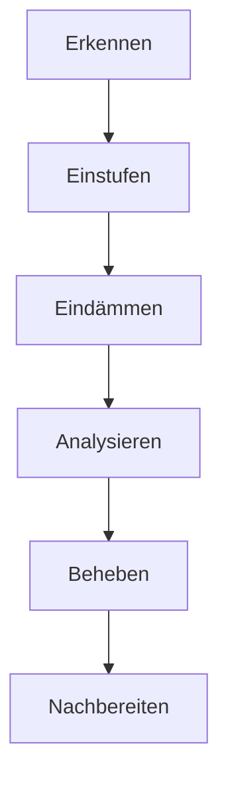
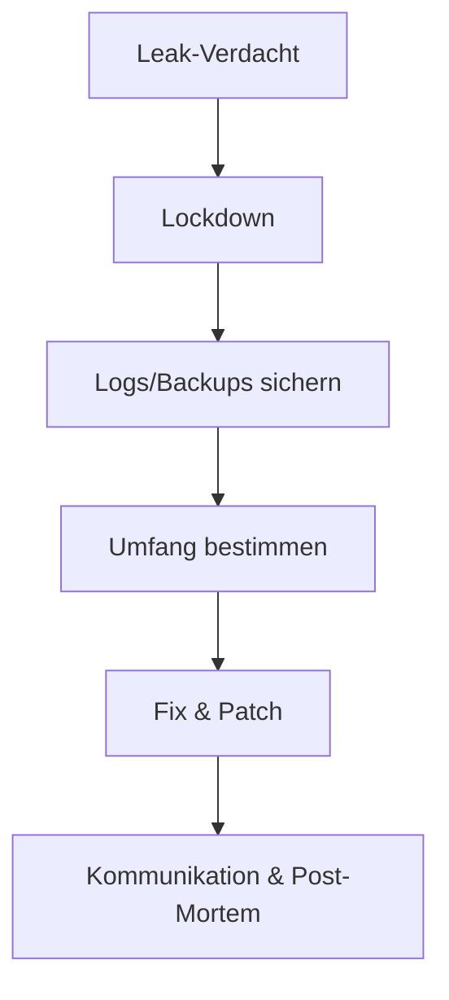

# Incident Runbooks — Sprint 4.3

**Stand:** 2026-02-13  
**Zweck:** Klare Ablaufpläne für häufige Sicherheits‑ und Betriebsvorfälle.

---

## 1) Allgemeiner Incident‑Ablauf (Kurz)

1. **Erkennen** – Monitoring, Logs, User‑Meldungen
2. **Einstufen** – Kritikalität (P0–P3)
3. **Eindämmen** – Risiko begrenzen (Lockdown, Rate‑Limits, Feature‑Toggle)
4. **Analysieren** – Ursache, Umfang, betroffene Daten
5. **Beheben** – Fix + Tests + Deploy
6. **Nachbereiten** – Post‑Mortem, Lessons Learned

### Schweregrade (P0–P3)

- **P0 (kritisch):** Datenverlust, kompletter Ausfall, Sicherheitsvorfall mit Datenabfluss
- **P1 (hoch):** Kernfunktion stark beeinträchtigt, viele Nutzer betroffen
- **P2 (mittel):** Teilfunktion beeinträchtigt, Workarounds vorhanden
- **P3 (niedrig):** Kosmetisch oder einzelne Nutzer betroffen

### Kommunikations‑Checkliste

- Incident‑Owner benennen
- Status‑Updates intern takten (z. B. alle 30–60 Min bei P0/P1)
- Externe Kommunikation nur nach Freigabe

---

## 2) Runbook: Verdacht auf kompromittierte Accounts

**Symptome:**
- Auffällige Logins / ungewöhnliche IPs
- Passwort‑Änderungen ohne User‑Wissen

**Sofortmaßnahmen:**
- Betroffene User **deaktivieren** (Admin‑UI)
- **Passwort‑Reset** erzwingen
- Session‑Cookies invalidieren (App‑Restart)

**Analyse:**
- Logs prüfen (Login‑Events, IP/UA‑Pattern)
- Betroffene Gruppen/Teilnehmer identifizieren

**Behebung:**
- Passwörter neu setzen
- Optional: IP‑Block/Rate‑Limit verschärfen

---

## 3) Runbook: CSP‑/Header‑Regression

**Symptome:**
- Security‑Header fehlen
- CSP‑Violations im Browser

**Sofortmaßnahmen:**
- Letzte Deployment‑Änderungen prüfen
- `app.py` CSP‑Middleware validieren

**Analyse:**
- Tests `test_security_headers.py` ausführen
- Live‑Header mit DevTools prüfen

**Behebung:**
- CSP‑Header reparieren
- Inline‑Scripts auf Nonce prüfen

---

## 4) Runbook: CSRF‑Probleme

**Symptome:**
- Form‑Actions schlagen fehl (403/400)

**Sofortmaßnahmen:**
- `WTF_CSRF_ENABLED` prüfen (prod = True)
- CSRF‑Token im Template prüfen

**Analyse:**
- Reproduzierbarkeit in Test‑/Staging
- Logs auf CSRF‑Errors prüfen

**Behebung:**
- Token‑Injection in Formularen sicherstellen
- API‑Routen ggf. `csrf.exempt` begründen

---

## 5) Runbook: Rate‑Limit‑Fehlfunktion

**Symptome:**
- Login‑Endpoint blockiert legitime User
- Keine 429 trotz Spam‑Versuchen

**Sofortmaßnahmen:**
- Limiter‑Config prüfen
- Thresholds temporär anpassen

**Analyse:**
- Tests `test_security_controls.py` ausführen
- Review von `auth.py` (Limiter Decorator)

**Behebung:**
- Rate‑Limit‑Settings korrigieren

---

## 6) Runbook: Prompt‑Leak / Sensible Daten im Output

**Symptome:**
- KI‑Output enthält unerwartete sensible Daten

**Sofortmaßnahmen:**
- Betroffene Prompts deaktivieren/ersetzen
- Exporte prüfen (Backups)

**Analyse:**
- Prompt‑Content prüfen
- Input‑Daten und Placeholder‑Injection prüfen

**Behebung:**
- Prompt anpassen (klarere Instruktionen)
- Output‑Checks schärfen

---

## 7) Runbook: Data‑Import Fehler / Inkonsistenz

**Symptome:**
- Import schlägt fehl
- Daten fehlen oder sind falsch gemappt

**Sofortmaßnahmen:**
- Import stoppen
- Backup prüfen

**Analyse:**
- Logs + Import‑Testfälle prüfen
- `data_io.py` Mapping verifizieren

**Behebung:**
- Mapping fixen
- Re‑Import mit Testdaten

---

## 8) Runbook: Datenbank‑Fehler / Korruption

**Symptome:**
- Fehler bei Abfragen, unerwartete Exceptions
- Fehlende/inkonsistente Datensätze

**Sofortmaßnahmen:**
- Schreibzugriffe pausieren (wenn möglich)
- Aktuelles Backup sichern

**Analyse:**
- Logs prüfen (DB‑Errors)
- Integrität/Schema prüfen

**Behebung:**
- Restore aus Backup (Test‑Restore vor Live)
- Migration‑Status prüfen

---

## 9) Runbook: Service‑Outage / 5xx‑Spike

**Symptome:**
- 5xx‑Fehler steigen
- Page lädt nicht oder extrem langsam

**Sofortmaßnahmen:**
- Fehler‑Rate prüfen
- Rollback erwägen (letztes Deployment)

**Analyse:**
- Logs/Tracing prüfen
- Repro in Staging

**Behebung:**
- Hotfix + Deploy
- Falls nötig: Feature‑Toggle nutzen

---

## 10) Runbook: Abhängigkeit/CVE entdeckt

**Symptome:**
- Sicherheitswarnung via pip‑audit/bandit/CI

**Sofortmaßnahmen:**
- Version und betroffenen Pfad identifizieren
- Risiko einstufen (Exploit‑Relevanz)

**Analyse:**
- Release Notes / Advisory prüfen
- Abhängigkeiten‑Tree analysieren

**Behebung:**
- Update/Pinning anpassen
- Regression‑Tests laufen lassen

---

## 11) Runbook: KI‑Provider Ausfall

**Symptome:**
- KI‑Analyse schlägt fehl (Timeout/5xx)

**Sofortmaßnahmen:**
- Provider‑Status prüfen
- Fallback‑Provider aktivieren (wenn verfügbar)

**Analyse:**
- Fehlerquote und Latenz prüfen
- API‑Quota verifizieren

**Behebung:**
- Retry‑Policy justieren
- Nutzer informieren (degradierter Modus)

---

## 12) Runbook: Verdacht auf Datenabfluss

**Symptome:**
- Externe Hinweise auf Leak
- Ungewöhnliche Exporte/Downloads

**Sofortmaßnahmen:**
- Zugriff einschränken (Admin‑Lockdown)
- Logs/Backups sichern

**Analyse:**
- Umfang/Zeitraum bestimmen
- Betroffene Datensätze identifizieren

**Behebung:**
- Sicherheitslücke schließen
- Meldung/Kommunikation gemäß Richtlinien

---

## 13) Runbook: Datei‑Upload mit Malware‑Verdacht

**Symptome:**
- Warnungen aus AV/Scanner
- Verdächtige Dateien in Uploads

**Sofortmaßnahmen:**
- Upload‑Pfad isolieren
- Betroffene Dateien entfernen/quarantäne

**Analyse:**
- Dateityp/MIME prüfen
- Herkunfts‑User identifizieren

**Behebung:**
- Upload‑Validierung verschärfen
- Optional: AV‑Scan integrieren

---

## 14) Post‑Mortem Template (Kurz)

- **Was ist passiert?**
- **Impact:** (Nutzer, Daten, Verfügbarkeit)
- **Root Cause:**
- **Fix:**
- **Lessons Learned:**
- **Follow‑up Tasks:**
